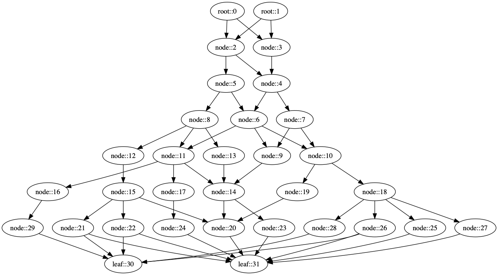
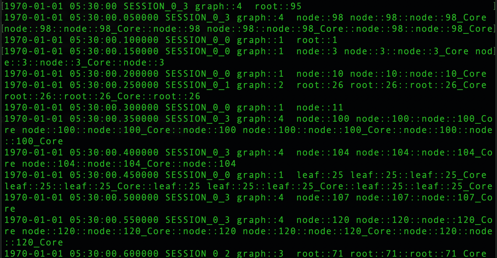
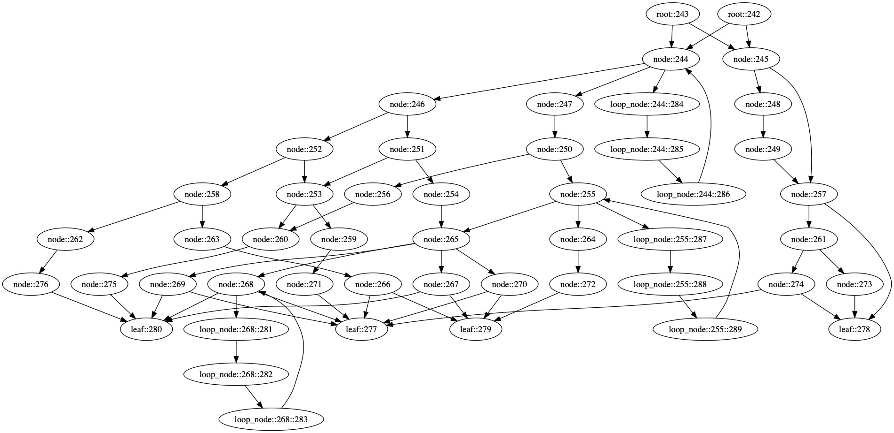
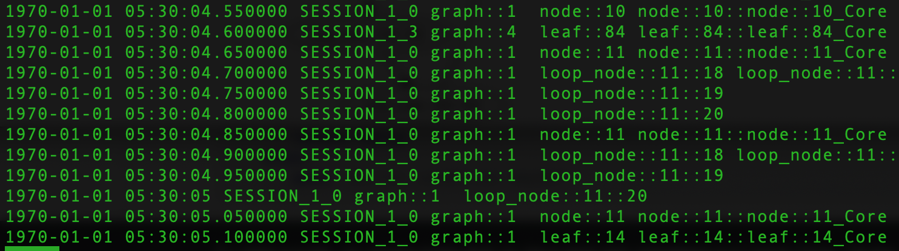

[](https://www.travis-ci.org/chaturv3di/absynthe)

# Absynthe: A (branching) Behavior Synthesizer

## Motivation

Absynthe came about in response to the need for test data for analysizing the
performance and accuracy of log analysis algorithms. Even though plenty of real
life logs are available, e.g. `/var/log/` in unix-based laptops, they do not
serve the purpose of test data. For that, we need to understand the core
application logic that is generating these logs.

A more interesting situation arises while trying to test log analytic (and
anomaly detection) solutions for distributed applications where multiple
sources or modules emit their respective log messages in a single log queue or
stream. This means that consecutive log lines could have originated from
different, unrelated application components. Absynthe provides _ground truth_
models to simulate such situations.

You need Absynthe if you wish to simulate the behavior of any well defined 
process -- whether it's a computer application or a business process flow.

## Overview

Each business process or compuater application is modelled as a _control flow
graph_ (or _CFG_), which typically has one or more roots (i.e. entry) nodes and
multiple leaf (i.e. end) nodes.

### Tree-like CFG

An example of a simple, tree-like CFG generated using Absynthe is shown below.
This is like a tree since nodes are laid out in levels, and nodes at level `i`
have outgoing edges only to nodes at level `i + 1`.



Each _behavior_ is the sequence of nodes encountered while traversing this CFG 
from a root to a leaf. Of course, a CFG might contain loops which could be
traversed multiple times before arriving at the leaf. Moreover, if there are
multiple CFGs, then Absynthe can synthesize _interleaved_ behaviors. This means
that a single sequence of nodes might contain nodes from multiple CFGs. We are 
ultimately interested in this interleaving behavior, which is produced by
multiple CFGs.



The above screenshot shows logs generated by Absynthe. Each log line starts
with a time stamp, followed by a session ID, CFG ID, and a log message. At
present, the log message is simply a random concatenation of the node ID to
which the log message corresponds. A single CFG might participate in multiple
sessions, where each session is a different traversal of the CFG. Therefore, we
maintain both session ID and CFG ID in the log line.

### Directed Cyclic CFG

An example of a more complex CFG, a directed cyclic graph, is shown in the
figure below. It expands the tree-like graph illustrated above by:

1. attaching loops on some of the nodes,
2. constructing skip-level edges, i.e. edges from a node at level `i` to a
node at level &ge;`(i + 2)`, and
3. optionally, upward edges (not shown here), i.e. edges from a node at
level `i` to a node at level &le;`(i - 1)`.



The identifiers of nodes appearing loops are helpfully prefixed with the
identifiers of nodes where these loops start and finish. Moreover, loops could
be traversed multiple times in a single behavior, as illustrated in the figure
below.



## Installation

The latest release is available on PyPi, simply `pip install absynthe`. The
`master` branch of this repository will always provide the latest release.

For the latest features, checkout the `develop` branch and `pip install .`.

## Usage

It is possible to start using Absynthe with two classes:

1. any concrete implementation of the abstract `GraphBuilder` class, which
generates CFGs, and
2. any concrete implementation of the abstract `Behavior` class, which
traverses the CFGs generated above and emits log messages.

For instance, consider the `basicLogGeneration` method in
`./examples/01_generateSimpleBehavior.py`:

```python3
from absynthe.graph_builder import TreeBuilder
from absynthe.behavior import MonospaceInterleaving


def basicLogGeneration(numRoots: int = 2, numLeaves: int = 4,
                       branching: int = 2, numInnerNodes: int = 16,
                       loggerNodeTypes: str = "SimpleLoggerNode"):
    # Capture all the arguments required by GraphBuilder class
    tree_kwargs = {TreeBuilder.KW_NUM_ROOTS: str(numRoots),
                   TreeBuilder.KW_NUM_LEAVES: str(numLeaves),
                   TreeBuilder.KW_BRANCHING_DEGREE: str(branching),
                   TreeBuilder.KW_NUM_INNER_NODES: str(numInnerNodes),
                   TreeBuilder.KW_SUPPORTED_NODE_TYPES: loggerNodeTypes}

    # Instantiate a concrete GraphBuilder. Note that the
    # generateNewGraph() method of this class returns a
    # new, randomly generated graph that (more or less)
    # satisfies all the parameters provided to the
    # constructor, viz. tree_kwargs in the present case.
    simpleTreeBuilder = TreeBuilder(**tree_kwargs)

    # Instantiate a concrete behavior generator. Some
    # behavior generators do not print unique session ID
    # for each run, but it's nice to have those.
    wSessionID: bool = True
    exBehavior = MonospaceInterleaving(wSessionID)

    # Add multiple graphs to this behavior generator. The
    # behaviors that it will synthesize would essentially
    # be interleavings of simultaneous traversals of all
    # these graphs.
    exBehavior.addGraph(simpleTreeBuilder.generateNewGraph())
    exBehavior.addGraph(simpleTreeBuilder.generateNewGraph())
    exBehavior.addGraph(simpleTreeBuilder.generateNewGraph())
    exBehavior.addGraph(simpleTreeBuilder.generateNewGraph())

    # Specify how many behaviors are to be synthesized,
    # and get going.
    numTraversalsOfEachGraph: int = 2
    for logLine in exBehavior.synthesize(numTraversalsOfEachGraph):
        print(logLine)
    return
```

## Comping Up...

### ...in v0.0.2

1. In `absynthe.graph_builder`, `DAGBuilder` and  `DCGBuilder` classes, which
build CFGs with skip-level edges and loops respectively.
2. In `absynthe.cfg.node`, `GaussianNode` and `BetaNode` classes, which exploit
the Gaussian and beta distributions, respectively, to select successor nodes at
the time of traversal.

### ...eventually

Sophisticated interleaving behaviors; logger nodes that emit more _life like_
log messages.